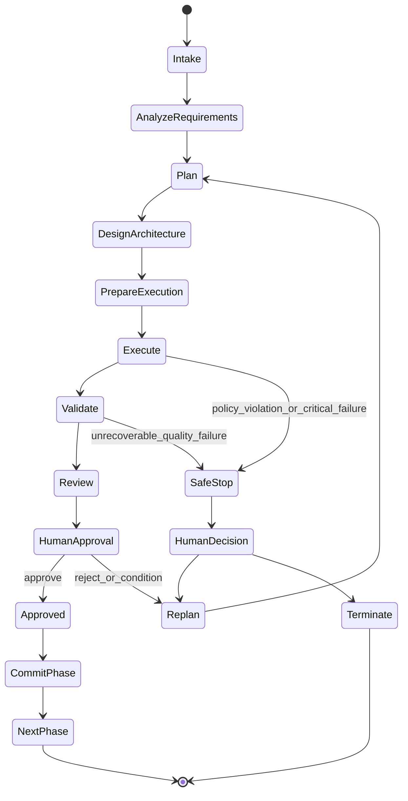
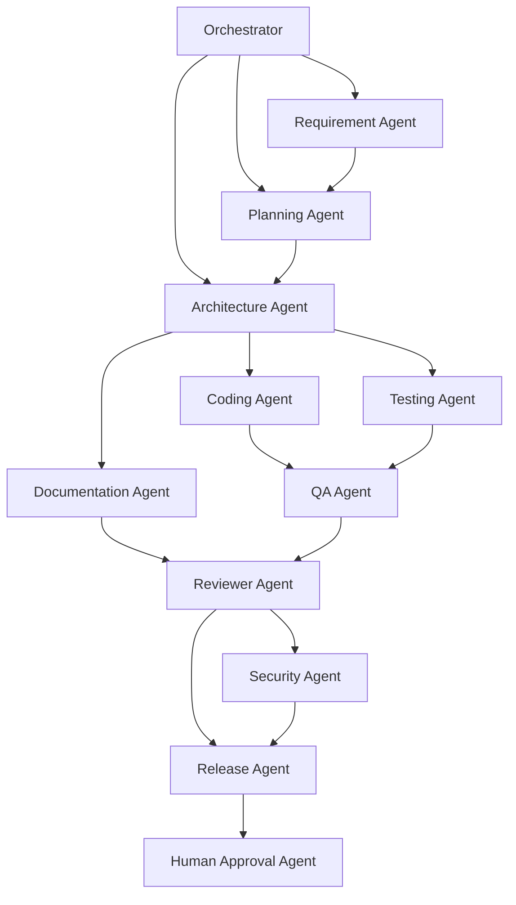
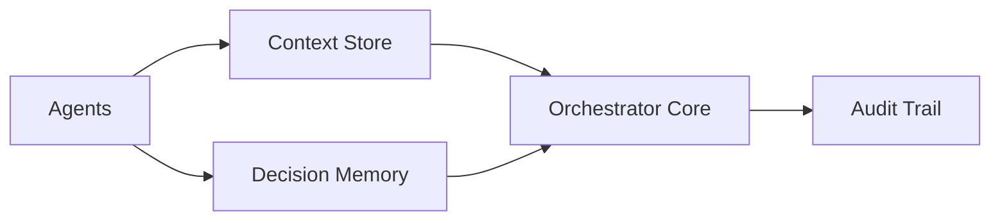
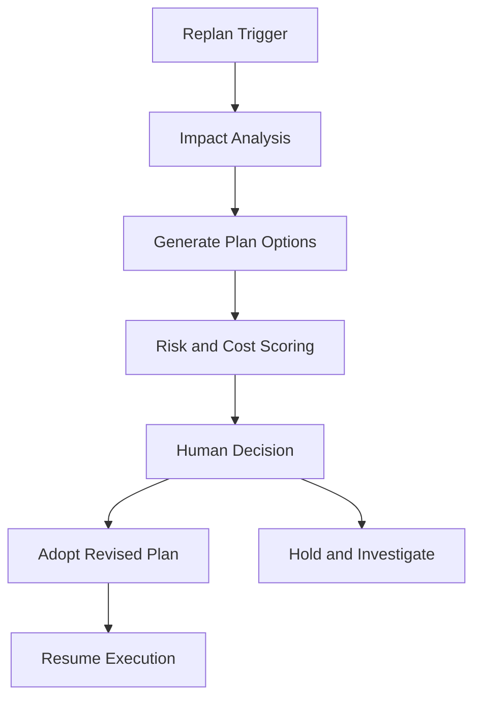
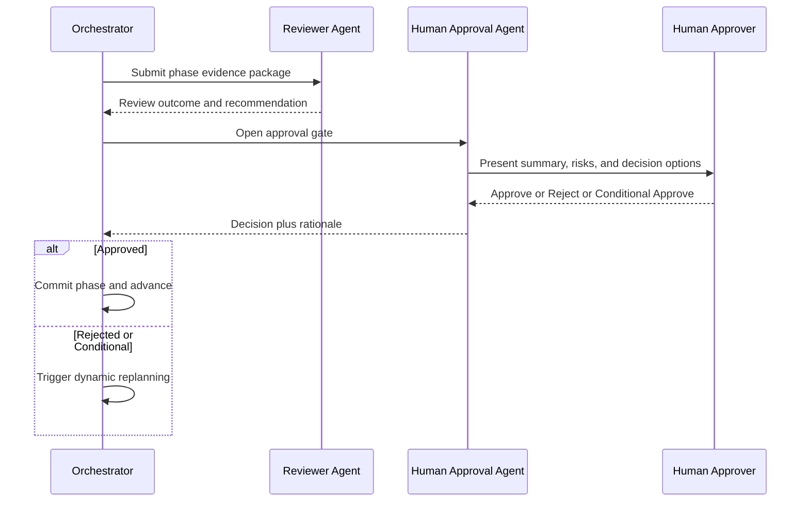

# Agentic SDLC Orchestrator Design

## 1. Purpose and Scope

This document defines the architecture and governance model for an Agentic SDLC Orchestrator that coordinates requirement analysis, planning, architecture, implementation, verification, release readiness, and human approvals for the URL Shortener platform.

The orchestrator is designed for controlled autonomy, deterministic phase delivery, and auditable engineering outcomes.

## 2. Agent Definitions

### 2.1 Orchestrator Core

1. Owns workflow state, execution plans, dependency resolution, and approval gates.
2. Schedules specialized agents using dependency- and risk-aware policies.
3. Enforces governance rules and safe-stop boundaries.

### 2.2 Requirement Agent

1. Extracts, normalizes, and version-controls product and business requirements.
2. Produces requirement baselines and identifies ambiguities.
3. Maintains trace links from requirements to downstream artifacts.

### 2.3 Planning Agent

1. Decomposes requirements into milestones, tasks, and acceptance checkpoints.
2. Builds dependency graph for execution ordering and parallelization.
3. Estimates scope risk and proposes staged delivery plans.

### 2.4 Architecture Agent

1. Produces context, component, runtime, and deployment architecture views.
2. Defines design constraints, quality attributes, and technology mapping.
3. Maintains architecture decision records and trade-off rationale.

### 2.5 Coding Agent

1. Implements approved backlog items following architecture constraints.
2. Enforces clean package boundaries and naming conventions.
3. Produces implementation artifacts with deterministic change sets.

### 2.6 Testing Agent

1. Generates and executes unit, integration, and environment-level tests.
2. Performs regression impact analysis against changed modules.
3. Reports coverage and pass/fail evidence for quality gates.

### 2.7 QA Agent

1. Validates requirement conformance, acceptance criteria, and NFR compliance.
2. Performs test evidence review and release quality scoring.
3. Raises defect findings with severity and traceable rationale.

### 2.8 Security Agent

1. Applies secure design and secure coding policy checks.
2. Detects threat, abuse, and data exposure risks in artifacts.
3. Produces remediation requirements and security gate decisions.

### 2.9 Documentation Agent

1. Produces and maintains BRD, FRD, architecture, runbooks, and release notes.
2. Ensures documentation traceability and consistency with implementation.
3. Enforces formatting, terminology, and version alignment standards.

### 2.10 Release Agent

1. Coordinates release-readiness checks, packaging, and deployment criteria.
2. Verifies rollback readiness and post-release validation plans.
3. Produces release decision dossier for human approval.

### 2.11 Reviewer Agent

1. Performs cross-artifact consistency and policy compliance review.
2. Reviews change risk, side effects, and unresolved dependencies.
3. Recommends approve, revise, or reject outcomes.

### 2.12 Human Approval Agent

1. Represents mandatory human gate interaction in orchestration flow.
2. Captures approval, rejection, and conditional approval decisions.
3. Records decision context for audit and traceability.

## 3. State Machine

State semantics:

1. SafeStop is a controlled halt that preserves context, artifacts, and evidence.
2. Replan is the dynamic replanning entry point.
3. HumanApproval is mandatory before phase commit.

## 4. Dependency Graph

```mermaid
flowchart LR
    BRD[Requirement Baseline] --> FRD[Functional Baseline]
    FRD --> ARCH[Architecture Artifacts]
    ARCH --> PLAN[Execution Plan]
    PLAN --> CODE[Implementation Changes]
    CODE --> TEST[Test Evidence]
    TEST --> QA[QA Validation]
    QA --> SEC[Security Validation]
    SEC --> DOC[Documentation Update]
    DOC --> REL[Release Readiness]
    REL --> HGA[Human Approval Gate]
```

Dependency policy:

1. Downstream agents cannot finalize outputs until upstream dependencies are satisfied.
2. Conditional dependencies can execute in parallel if no artifact conflict exists.

## 5. Execution Graph and Parallel Execution

Parallel execution rules:

1. Testing Agent and Documentation Agent may run parallel to Coding Agent after architecture lock.
2. QA Agent starts when minimum evidence threshold is met from Coding and Testing.
3. Security Agent and Release Agent may run partially parallel with Reviewer Agent, then synchronize before approval.

## 6. Retry Strategy

Retry classes:

1. Transient failures: retry with exponential backoff and jitter.
2. Deterministic validation failures: no retry, route to replanning.
3. External tool failures: bounded retries with fallback path.

Retry policy controls:

1. Max attempt count per step and per phase.
2. Cumulative retry budget to prevent runaway orchestration loops.
3. Retry telemetry for reliability scoring.

## 7. Rollback Strategy

Rollback dimensions:

1. Artifact rollback: revert to last approved baseline artifact version.
2. Plan rollback: restore previous execution plan graph snapshot.
3. Decision rollback: reopen last approval gate when conditional assumptions break.

Rollback constraints:

1. Rollback must preserve full audit history.
2. Rollback does not delete evidence; it creates superseding records.

## 8. Fallback Strategy

Fallback levels:

1. Agent fallback: route task to Reviewer Agent when specialist agent confidence drops below threshold.
2. Workflow fallback: switch from parallel mode to serial mode under instability.
3. Governance fallback: enforce human-in-the-loop for all state transitions during incident mode.

Fallback triggers:

1. Repeated retry exhaustion.
2. Contradictory outputs between agents.
3. Critical policy validation failures.

## 9. Safe Stop Model

Safe stop guarantees:

1. No partial commit after gate failure.
2. Context store snapshot and decision memory checkpoint are captured.
3. Open tasks are marked suspended with resumable state.
4. Human approval is required to resume execution.

## 10. Decision Memory and Context Store

Decision memory design:

1. Stores phase decisions, approvals, rejections, conditions, and rationale.
2. Maintains immutable timeline of decision transitions.
3. Supports query by phase, requirement ID, and agent role.

Context store design:

1. Stores requirement baseline, architecture context, active plan graph, and evidence references.
2. Uses scoped partitions: global, phase, and task context.
3. Applies retention and snapshot policies for reproducibility.

## 11. Audit Trail

Audit trail requirements:

1. Capture who acted, what changed, when, and why.
2. Record state transitions with pre- and post-state identifiers.
3. Link each action to source artifact and gate decision.
4. Preserve non-repudiation via immutable append-only records.

## 12. Reliability Metrics

Core orchestrator reliability metrics:

1. Phase completion success rate.
2. First-pass approval rate per gate.
3. Mean retries per workflow step.
4. Safe-stop incidence rate.
5. Mean time to recovery after safe stop.
6. Replan frequency and cause distribution.
7. Artifact traceability completeness ratio.
8. Human override frequency.

Reliability SLO examples:

1. Orchestration phase completion success rate >= 95 percent.
2. Traceability completeness >= 99 percent.
3. Audit record write success = 100 percent.

## 13. Governance Rules

1. No phase progression without human approval gate pass.
2. No implementation before architecture and planning approvals are complete.
3. All outputs must be traceable to approved requirements.
4. Policy violations force immediate safe stop.
5. Replanning is mandatory after rejection or conditional approval with unresolved constraints.
6. Commits are phase-scoped and evidence-backed.

## 14. Dynamic Replanning

Dynamic replanning triggers:

1. Requirement changes.
2. Gate rejection.
3. Unacceptable reliability degradation.
4. New security or compliance constraints.

Dynamic replanning flow:

Replanning constraints:

1. Existing audit history remains immutable.
2. Revised plan must retain requirement traceability.
3. New plan cannot bypass mandatory gate order.

## 15. Human Approval Workflow

Approval controls:

1. Every gate decision must include rationale.
2. Conditional approvals require explicit action list and closure verification.
3. Rejected gates must generate replan ticket set with owner assignments.

## 16. End-to-End Control Summary

1. The orchestrator enforces deterministic progression through state machine and approval gates.
2. Parallel execution is allowed only for dependency-safe branches.
3. Retry, rollback, fallback, and safe stop provide resilience without losing auditability.
4. Decision memory and context store provide reproducibility and continuity.
5. Governance rules and human workflow preserve control over autonomous execution.