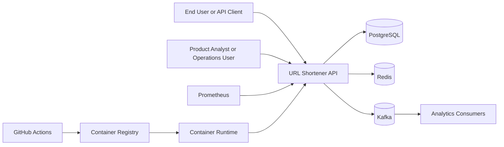
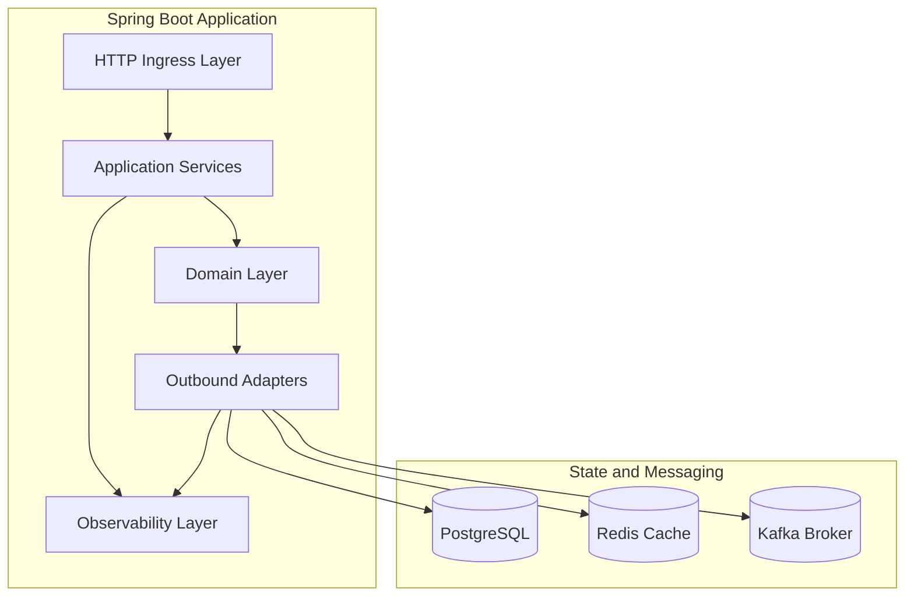
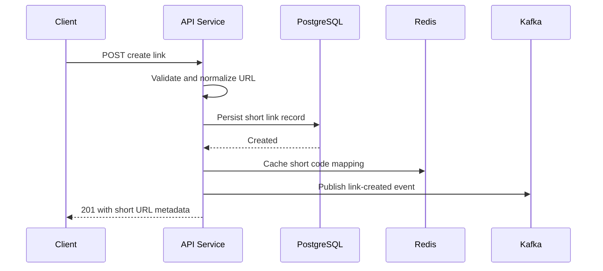
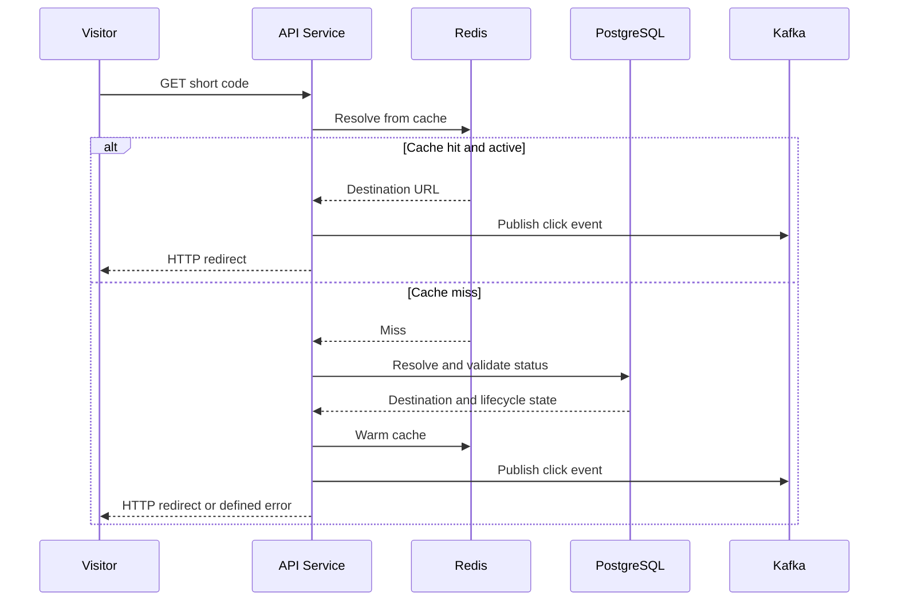
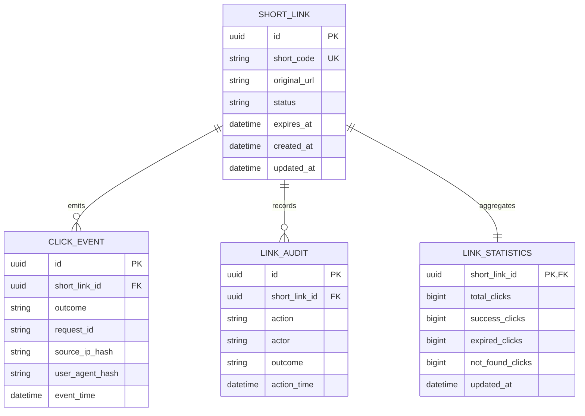
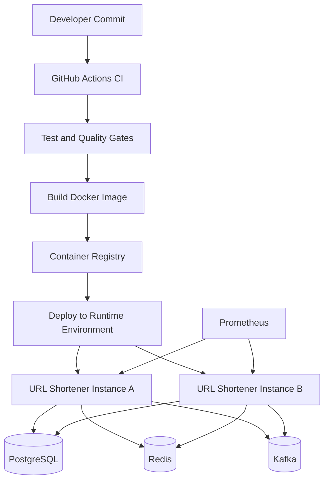
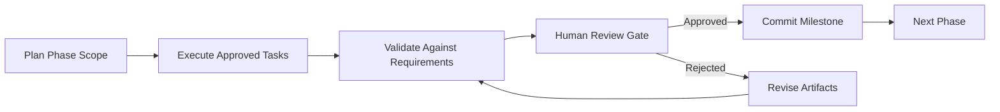

# URL Shortener Platform Architecture

## 1. Architecture Objectives

1. Deliver low-latency, high-availability URL redirection under read-heavy traffic.
2. Preserve strong data consistency for link identity and lifecycle state.
3. Decouple synchronous redirect flows from asynchronous analytics processing.
4. Provide production-grade observability, traceability, and operational control.
5. Enforce phase-gated delivery with human approval checkpoints.

## 2. System Context

Context boundaries:

1. Platform boundary includes API service, persistence, cache, events, and telemetry.
2. External actors include end users, analysts, and operations systems.
3. External platforms include CI/CD and runtime orchestration.

## 3. Component Architecture

Component responsibilities:

1. HTTP Ingress Layer: request validation, routing, serialization, and error envelope mapping.
2. Application Services: use-case orchestration for create, resolve, and analytics queries.
3. Domain Layer: link identity, lifecycle rules, expiration policy, and business invariants.
4. Outbound Adapters: PostgreSQL repositories, Redis cache gateway, Kafka event producer.
5. Observability Layer: metrics, traces, structured logs, and health indicators.

## 4. Core Runtime Sequences

### 4.1 Create Short Link Sequence

### 4.2 Redirect Sequence

## 5. Database Design

### 5.1 Logical Model

### 5.2 Persistence Principles

1. PostgreSQL is the authoritative store for link lifecycle state.
2. Short code uniqueness is enforced via unique constraint and indexed lookup.
3. Statistics are maintained as query-efficient aggregates.
4. Audit entries are immutable append-only records.
5. UTC timestamps are used for all temporal fields.

## 6. Redis Architecture

Redis usage:

1. Primary key pattern: short-code to destination and status projection.
2. TTL policy: bounded by link expiration and cache freshness strategy.
3. Read path: cache-first, database fallback.
4. Write path: cache write-through on create and targeted invalidation on status changes.
5. Failure mode: graceful degradation to PostgreSQL with latency impact only.

Key operational metrics:

1. Cache hit ratio.
2. Cache latency.
3. Eviction rate.
4. Keyspace growth and memory utilization.

## 7. Kafka Architecture

Topic design:

1. Link lifecycle topic for create and status transition events.
2. Click event topic for redirect outcomes.

Delivery and ordering:

1. Partition key uses short code to preserve per-link ordering.
2. Producer uses idempotent publish configuration to reduce duplicates.
3. Consumers apply at-least-once semantics with idempotent processing safeguards.

Operational controls:

1. Retry with exponential backoff for transient broker failures.
2. Dead-letter policy for non-recoverable message processing errors.
3. Lag monitoring and alerting for consumer health.

## 8. Deployment Architecture

Deployment characteristics:

1. Stateless application instances support horizontal scaling.
2. Shared state services include PostgreSQL, Redis, and Kafka.
3. CI enforces test and quality gates before image publication.
4. Runtime health endpoints are used for readiness and liveness control.

## 9. Folder Structure

Target repository structure:

1. docs: BRD, FRD, architecture, operational documents.
2. src/main/java: production backend implementation.
3. src/main/resources: application configuration and migration scripts.
4. src/test/java: unit and integration tests.
5. infra: container and deployment descriptors.
6. .github/workflows: CI pipelines.

## 10. Package Structure

Clean architecture package layout:

1. application: use cases, command-query services, and orchestration.
2. domain: entities, value objects, domain services, and business rules.
3. infrastructure: database, cache, messaging, and external adapters.
4. interfaces: REST controllers, DTOs, and request-response mapping.
5. configuration: framework wiring, security, telemetry, and runtime setup.

## 11. Agent Orchestration Architecture

Agentic execution model:

1. Orchestrator agent coordinates milestone progress and artifact generation.
2. Specialist roles include architect, backend engineer, QA lead, DevOps engineer, and technical writer.
3. Work is constrained to approved phase scope.
4. Every milestone outcome is auditable through committed artifacts.

Control loop:

## 12. Human Approval Gates

Mandatory approval checkpoints:

1. Gate 1: BRD approval.
2. Gate 2: FRD approval.
3. Gate 3: Architecture approval.
4. Gate 4: Bootstrap and implementation readiness.
5. Gate 5: Test and release readiness.

Gate criteria:

1. Scope compliance with approved phase.
2. Traceability to prior requirements.
3. Quality evidence and risk treatment.
4. Commit-ready documentation or code artifacts.

## 13. Retry Strategy

Retry policies by dependency:

1. PostgreSQL transient failures: bounded retries with exponential backoff and jitter.
2. Redis transient failures: short bounded retries, then fallback to PostgreSQL for read path.
3. Kafka publish retries: idempotent producer retries with bounded delivery timeout.
4. Non-retryable validation or business rule failures: fail fast without retry.

Retry governance:

1. Circuit-break style protection prevents cascading failures.
2. Retry metrics are captured for alerting and tuning.
3. Maximum retry budgets prevent unbounded resource consumption.

## 14. Rollback Strategy

Rollback layers:

1. Application rollback: redeploy previous stable container image.
2. Schema rollback: forward-fix preferred; reversible migrations only where safe.
3. Configuration rollback: versioned config with rapid revert mechanism.
4. Event handling rollback: consumer replay strategy with idempotent processors.

Release safeguards:

1. Progressive rollout with health-based promotion.
2. Automated smoke checks post-deployment.
3. Defined rollback trigger thresholds for error rate and latency.

## 15. Observability Architecture

Telemetry pillars:

1. Metrics: request throughput, latency percentiles, error rates, cache hit ratio, Kafka publish and lag indicators.
2. Logs: structured request and application logs with correlation identifiers.
3. Traces: distributed tracing across API, cache, database, and messaging boundaries.
4. Health: liveness, readiness, and dependency status probes.

Alerting baselines:

1. Redirect p95 and p99 latency breaches.
2. Elevated 5xx error rates.
3. Cache hit ratio degradation.
4. Kafka publish failure spikes or lag growth.
5. Database connectivity instability.

## 16. Traceability Architecture

Traceability model:

1. BRD requirement identifiers map to FRD functional requirements.
2. FRD functional requirements map to architecture components and runtime flows.
3. Architecture components map to implementation modules and tests in later phases.
4. Every phase output is linked to a single milestone commit for auditability.

Traceability matrix:

| BRD Requirement | FRD ID | Architecture Element |
| --- | --- | --- |
| Create short URL | FR-01 | Application service, PostgreSQL adapter, Redis warm-up |
| Resolve and redirect | FR-02 | Redirect flow, cache-first resolver, HTTP ingress |
| Expiration enforcement | FR-03 | Domain lifecycle policy, status validation |
| Click capture | FR-04 | Redirect event emission path |
| Kafka publication | FR-05 | Event producer and topic strategy |
| Metadata and statistics | FR-06 | Query services and read models |
| Redis optimization | FR-07 | Cache gateway and fallback strategy |
| PostgreSQL persistence | FR-08 | Repository adapters and schema model |
| OpenAPI contract | FR-09 | Interface layer and contract publication |
| Health and telemetry | FR-10 | Observability layer and actuator endpoints |

## 17. Architecture Decisions Summary

1. Use PostgreSQL as source of truth and Redis as performance cache.
2. Use Kafka for asynchronous clickstream and lifecycle event propagation.
3. Use stateless application instances for horizontal scaling.
4. Enforce controlled autonomy via phase gates and explicit human approval.
5. Anchor operations on measurable SLO-aligned telemetry.