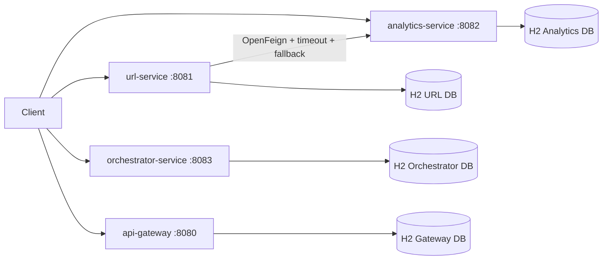
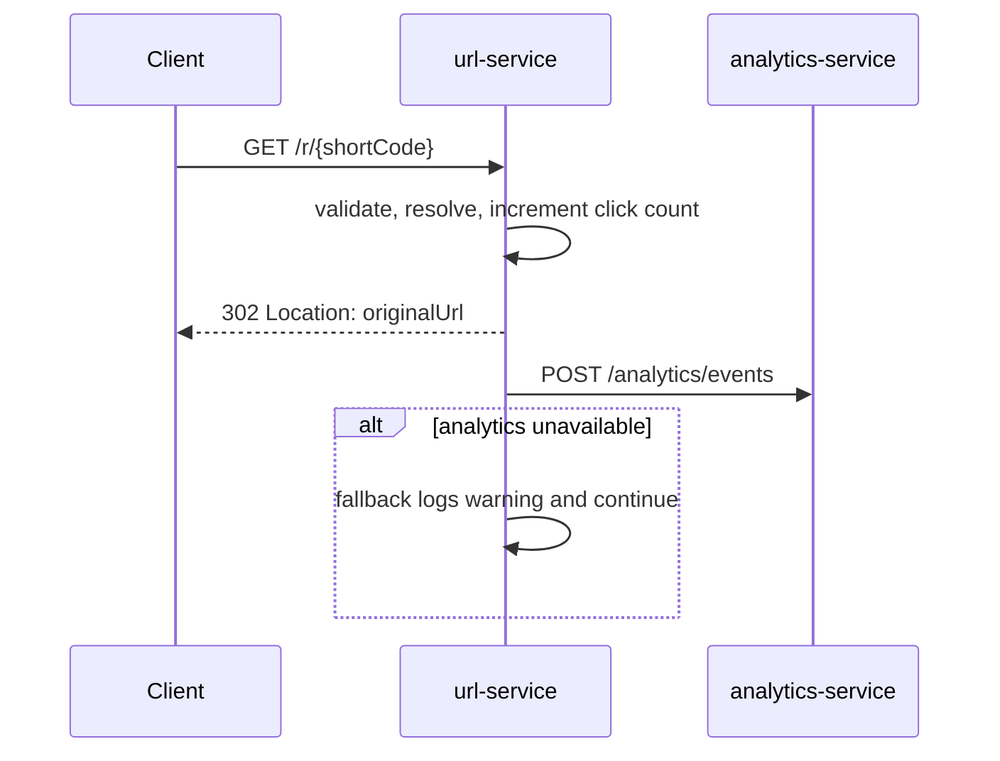
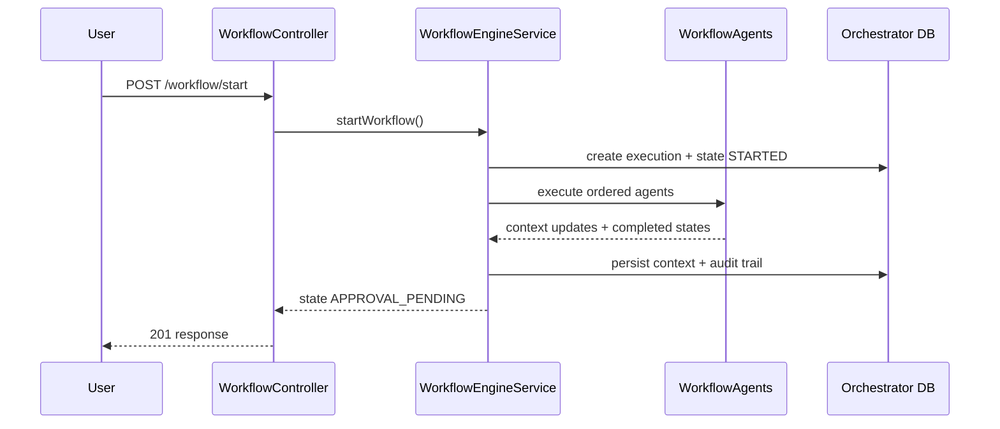
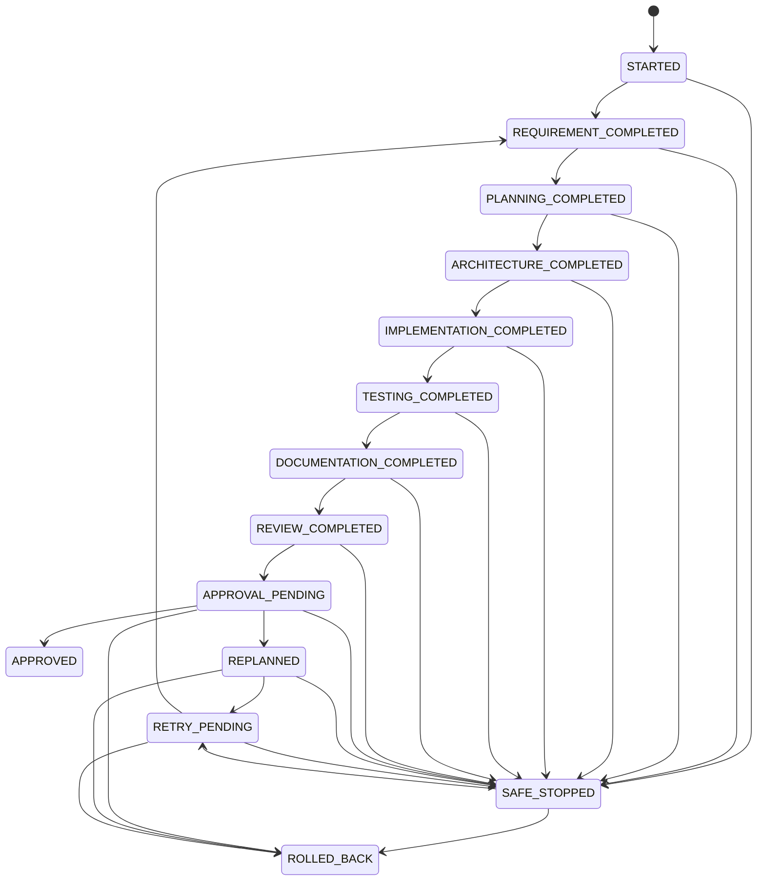

# Architecture

## System overview

The platform is implemented as a Maven multi-module project with four Spring Boot services.

- api-gateway: external entrypoint and shared operational endpoints.
- url-service: core URL lifecycle and redirect handling.
- analytics-service: clickstream event storage and analytics queries.
- orchestrator-service: agentic SDLC workflow orchestration engine.

## Component architecture

## Redirect and analytics sequence

## Orchestration engine sequence

## Workflow state machine

## Internal layering pattern

Each service follows a conventional package layout:

- controller
- service
- repository
- entity
- dto
- mapper
- exception
- config
- util/validation/common

## Operational defaults

- OpenAPI endpoint per service: /v3/api-docs
- Swagger UI per service: /swagger-ui.html
- Health endpoint per service: /internal/health
- Management endpoint exposure: health, prometheus